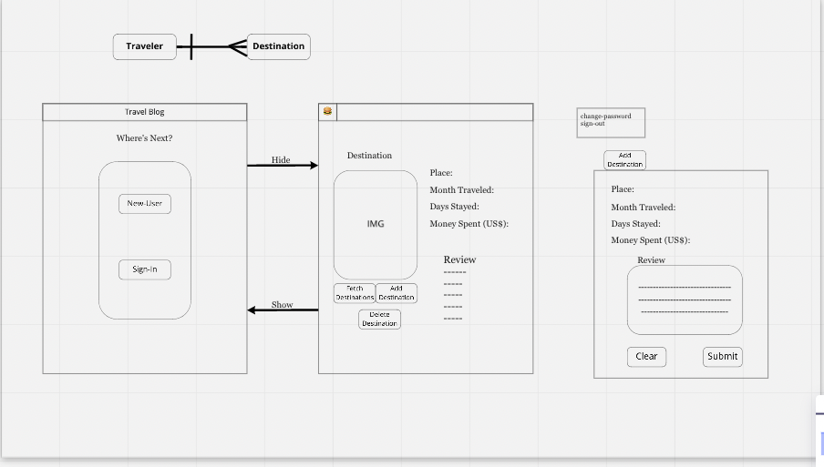

 
# Hishams Destination Blog
---
## The BackStory
- This project has allowed me to incorporate everything we have learned in this bootcamp up until now.
- I used HTML, SCSS, JavaScript, Express JQuery and learned how to use curl scirpts along with AJAX.
- To me it was much more than a project - it was a big learning experience.
- Full Stack with custome API.
---
## Instructions
1. User must use Sign-Up form, once completed User will be prompted with and error or success message 
      - POST REQUEST made will recieve either 200 OK or 400 error 
2. If user recieved an error message, than the user must complete Sign-Up form again
3. When User has completed Sign-Up form with correct credentials they will recieve a success message highlighted in green text
4. User must input credentials into the Sign-In form, here they will also be prompted with a error or success message
      - POST REQUEST made will recieve either 200 OK or 400 error
5. If User input matched the Sign-Up credentials than the User will be get a success message and immediatly moved to the Blog Page
6. Once User is in the Blog Page User will be able to create a destination
      - POST REQUEST made will recieve either 200 OK or 400 error
7. User will be able to update, delete the destination 
8. Once User can see all destinations made by all users but can only edit the ones tied to their token
9. User can choose to change password in the navbar 
      - PATCH REQUEST made will recieve either 200 OK or 400 error message
10. User can choose to Sign-out and the board will be Deleted
      - DELETE REQUEST made will recieve either 200 OK or 400 error message
11. User can sign out and all data will be saved

## WireFrame
Hishams Wireframe file

 1. Client must be able to sign-up successfully
 - upon. Clicking sign-up  submit button if successful user will be prompt with sign up message
 - if sign-up failed then user will be prompt with error message

 2. Client must be able to sign in successfully
 - once sign-in submit button is clicked user will be prompt with a success or error message
 - client will be directed to the Destination page

 3. Client destination page
 - client will use hamburger drop-down to sign-out and change-password
 - client must see fetch, add and delete buttons to interact with the database

4. Client will interact with the database
 - client can add a destination: upon adding a destination client will fill out the destination form and submit
 - client submission will be saved into the database
- client will be able to update
 5. Client will be able to fetch/get all destinations
- all destinations will show
- client can get one destination by the ID

 6. Client will be able to delete a destination
 - once deleted client should not be able to see it them when fetching the destinations.